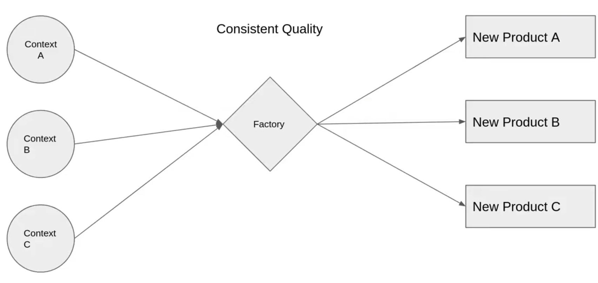

## Discussing the factory method design pattern

- Factory method design pattern mainly used if i don't know the number of class or object that will be created from the class, so i want to give the client and abstracted easy option to add another choices to the application.

- For example: if i have a pizza resturant and i introduce some kinds of pizza like marggrita, meat and chicken, but i noticed that a huge number of clients want another kinds like Chicago, Sicilian and Detroit style. Without using the factory method design pattern, i have to go create a class for each type and then go to the each page uses the pizza and add the new types to it, and the same logic if i want to remove a pizza.

- Then here comes the solution using the factory design pattern, instead of making the object creation or deletion inconsistent, i will use a factory that take requests as what i want, then start to give me the object i need, and the code refactoring became very good.



- inside the Factory class, i will write any logic related to pizza object creation, so if i want to add a new pizza, i will add to the factory, and if i want to delete it, i will delete it from the factory.

- Example
  - Say you are making a cross platform application. and each platform has a distinct UI from the other, so lets focus on the button appearance, it differs on mac from windows and android.. so lets think about the number of pages that i will need to put a button on it, it is HUGE. if i did not use a factory method, then i will handle it like
  ```typescript
  if (platform === "MAC") getMacButton();
  else if (platform === "Windows") getWindowsButton();
  else getAndroidButton();
  ```
  - But using factory method design pattern can make it easy, i will create a class that contain this conditions and call it like
  ```ts
  button = factory.createButton(platform);
  ```
  and now my code is handled into one place, i don't care about how the object will be created as the factory will take care of this operation
